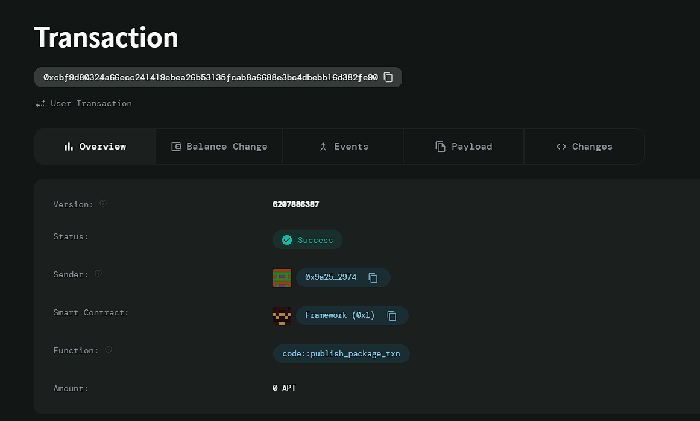

# Tokenized Carbon Credits

# Deployed ID: 0xcbf9d80324a66ecc241419ebea26b53135fcab8a6688e3bc4dbebb16d382fe90

## Project Description
A marketplace for trading carbon credits as tokens, allowing businesses and individuals to offset their carbon footprints. The smart contract verifies the authenticity of carbon credits and facilitates transactions between buyers and sellers, providing a transparent record of carbon offsets that can be audited for environmental impact.

## Project Vision
To create a sustainable marketplace that empowers individuals and businesses to participate in environmental conservation by trading verified carbon credits, ensuring transparency and accountability in carbon offsetting.

## Key Features
- **Verification of Carbon Credits**: Ensures that all traded carbon credits are verified for authenticity.
- **Ownership Transfer**: Allows for the seamless transfer of carbon credit ownership between users.
- **Transparent Transactions**: Maintains a clear record of all transactions for auditing purposes.
